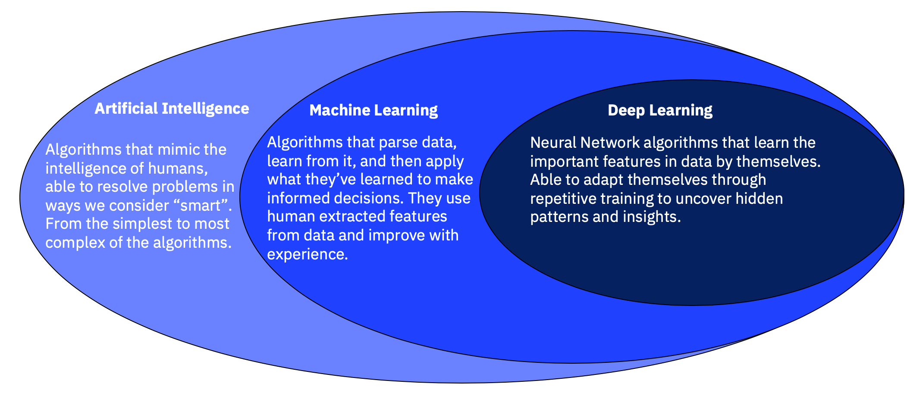

# Conteúdo: Python e IA
Repositório criado para compartilhamento de conteúdos (vídeos, cursos, livros, etc) sobre Python, Inteligência Artificial e afins.

## Conceitos Básicos

**Disclaimer**: recomendo a leitura das documentações das bibliotecas à medida que forem surgindo dúvidas, mas não de forma integral, uma vez que as bibliotecas apresentam funcionalidades além do necessário nesse momento (básico apenas).

- Python: linguagem de programação de alto nível utilizada, dentre outras aplicações, em diversos projetos de Inteligência Artificial, Aprendizado de Máquina (_Machine Learning_), Ciência/Engenharia de Dados.

- Jupyter Notebook: combinação de células de texto e código, frequentemente utilizada na análise de dados e compartilhamento de trabalhos envolvendo Python.

- SQL: linguagem de consulta utilizada em bancos de dados do tipo relacional, cujos dados apresentam-se em tabelas. Os métodos mais simples (como SELECT e JOIN) são mais do que suficientes para o trabalho inicial. Além disso, a biblioteca Pandas pode ser uma facilitadora nesse quesito, uma vez que ela consegue realizar _queries_ (consultas) sem que o usuário venha a utilizar a linguagem SQL.

- Pandas - [Documentação](https://pandas.pydata.org/docs/): biblioteca Python muito utilizada em análise de dados. Apresenta funções semelhantes ao Excel e é baseada em Dataframes - que são estruturas de dados análogas a tabelas.

- Numpy - [Documentação](https://numpy.org/doc/stable/): biblioteca Python para matemática científica

- [Github](https://github.com/): plataforma de hospedagem de código e arquivos com controle de versão.

- Inteligência Artificial, Aprendizado de Máquina (_Machine Learning_) e Aprendizado Profundo ((_Deep Learning_)): importante saber diferenciar os 3 tópicos. A principal diferença está na forma de aprendizado envolvido.\
Durante o processo utilizaremos de redes neurais para realizar algumas previsões, estas estão contidas na área do Aprendizado Profundo.\
O seguinte artigo aborda essa questão: https://www.ibm.com/blogs/systems/ai-machine-learning-and-deep-learning-whats-the-difference/ \
A imagem abaixo representa a relação entre as 3 áreas.

||
|:--:|
||
|Fonte: [IBM: AI, machine learning and deep learning: What’s the difference?](https://www.ibm.com/blogs/systems/ai-machine-learning-and-deep-learning-whats-the-difference/)|

## Sites/Blogs/etc
- [Medium](https://medium.com/): conteúdo escrito pela comunidade. Contém bons artigos, mas é importante ter cuidado uma vez que o artigo é feito pela comunidade.
- [Towards Data Science](https://towardsdatascience.com/): blog hospedado no Medium voltado para Data Science, envolvendo assuntos como _Machine Learning_ e _Deep Learning_.
- [Programação Dinâmica](https://medium.com/programacaodinamica): Ensino de programação e discussões sobre tecnologia. Abordam conteúdo de IA/ML e a maioria das vezes utilizam Python como linguagem de programação.
- [Referências Teo Calvo](https://github.com/teocalvo/teomerefs): possui inúmeras referências, desde youtubers até livros. **Recomendo os livros de programação**.
- [Guia do Cientista de Dados das Galáxias](https://github.com/PizzaDeDados/datascience-pizza): conjunto de referências assim como o link acima, sendo que voltado para o universo da Ciência de Dados em específico.

## Cursos Gratuitos
- [Udemy: Introdução à linguagem Python ~2h](https://www.udemy.com/course/intro_python/)
- [Solyd: Python Básico ~8h](https://solyd.com.br/treinamentos/python-basico/): recomendo até a aula 7.
- [Data Science Academy: Python Fundamentos Para Análise de Dados >60h](https://www.datascienceacademy.com.br/course/python-fundamentos): Curso bem completo porém muito extenso, recomendo para um momento futuro ao se aprofundar um pouco mais. Uma ressalva apenas quanto a IDE utilizada: em vez de PyCharm, recomendo o Visual Studio Code.
- [Data Analysis with Python](https://youtube.com/playlist?list=PLWKjhJtqVAblvI1i46ScbKV2jH1gdL7VQ)
- [Teo Calvo: Imersão de Pandas ~8h](https://www.twitch.tv/videos/904658646)\
  Apresentação da biblioteca Pandas. O conteúdo apresentado por Teo, de forma geral, é excelente.

## RoadMap de Estudos
1. Configuração de ambiente com Anaconda: https://www.youtube.com/watch?v=XCvgyvBFjyM
2. Python
    - Conceitos básicos: tipos de variáveis, tipos e estruturas de dados
    - Métodos, estruturas de repetição, condicionais, 
    - Bibliotecas
    - Manipulação de arquivos (csv, json, etc)
2. Inteligência Artificial
    - Conceitos Básicos
3. Machine Learning
    - Conceitos básicos
    - Algoritmos básicos
    - Biblioteca Scikit-learn: através desta é possível implementar modelos relativamente simples
4. Deep Learning
    - Conceitos básicos
    - Tipos de redes neurais
    - Biblioteca TensorFlow + Keras
